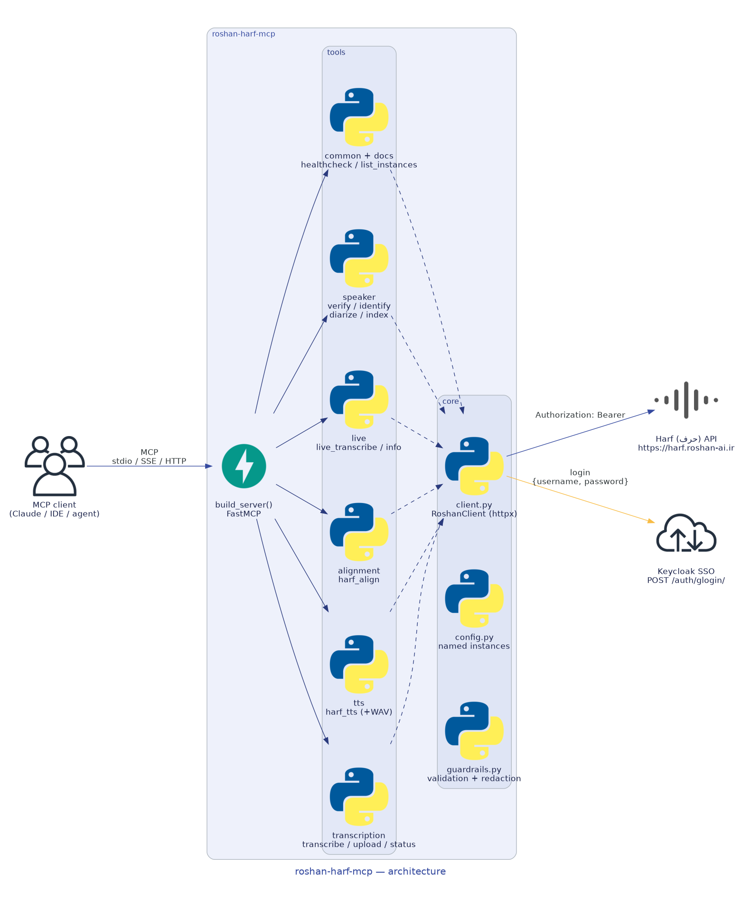
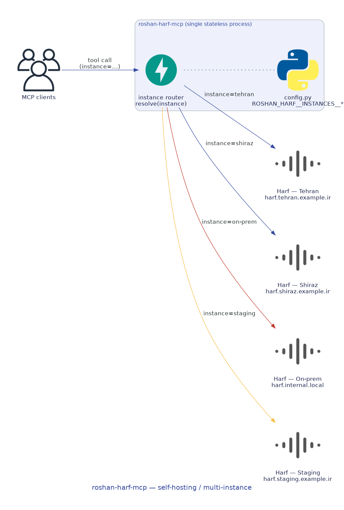
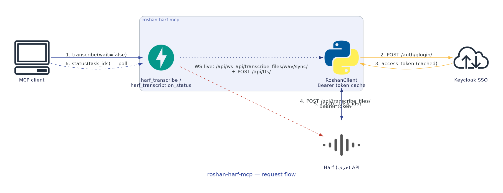

<div align="center">


# roshan-harf-mcp

**A self-hostable [Model Context Protocol](https://modelcontextprotocol.io) server for Roshan AI's
Persian speech service, [Harf (حرف)](https://docs.roshan-ai.ir).**

<sub>Transcription (ASR) · forced alignment · real-time streaming · speaker verification,
identification, diarization &amp; indexing.<br/>Unofficial community integration, built from the public
docs at <a href="https://docs.roshan-ai.ir">docs.roshan-ai.ir</a>.</sub>

</div>

---

## What is this?

[Harf (حرف)](https://docs.roshan-ai.ir) is Roshan AI's **native Persian** speech-to-text engine. It
turns audio, video, and even live streams into Persian text with high accuracy, and ships a family of
speaker-analysis endpoints on top.

`roshan-harf-mcp` wraps that HTTP/WebSocket API as **MCP tools** so Claude — or any MCP client — can
use Harf as a first-class capability. Harf is token-authenticated and **self-hosted**; organizations
typically run **many independent instances** (per region, per tenant, dev/staging/prod). This server
treats **named instances** as a core concept: every tool accepts an optional `instance` argument and
routes the request to that deployment.

---

## Features

- **Full Harf coverage** — transcription (URL + upload + async polling), alignment, live streaming,
  and all four speaker tasks.
- **Many self-hosted instances** — route any call to a named Harf deployment; secrets never leave the
  process.
- **Three transports** — `stdio` (default), `sse`, and `streamable-http`.
- **Safe by default** — http(s) URL validation, list-size clamps, and token redaction in logs/errors.
- **Batteries included** — Docker image, Docker Compose, Helm chart, raw Kubernetes manifests, and a
  Terraform module.

---

## Installation

```bash
# From the project directory (roshan-harf-mcp/)
python -m venv .venv && . .venv/bin/activate
pip install -e ".[dev]"      # dev extras: pytest, pytest-asyncio, respx, ruff
```

Requires Python >= 3.11.

---

## Quick start

```bash
# Point at the public (or your self-hosted) Harf and run over stdio
export ROSHAN_HARF_BASE_URL="https://harf.roshan-ai.ir"
export ROSHAN_HARF_TOKEN="<your-token>"

python -m roshan_harf_mcp                       # stdio (default)
python -m roshan_harf_mcp --transport streamable-http --host 0.0.0.0 --port 8000
```

> Request a `TOKEN_KEY` from Roshan by emailing
> [harf@roshan-ai.ir](mailto:harf@roshan-ai.ir).

---

## Configuration

Configuration is environment-driven (via `pydantic-settings`). Two styles are supported.

### Shorthand (single instance)

| Variable | Description | Default |
|----------|-------------|---------|
| `ROSHAN_HARF_BASE_URL` | Base URL of the default Harf instance | `https://harf.roshan-ai.ir` |
| `ROSHAN_HARF_TOKEN` | API token for the default instance (`Authorization: Token …`) | _(none)_ |

These synthesize an instance named `default`.

### Multi-instance (nested)

Prefix `ROSHAN_HARF__`, nested delimiter `__`:

| Variable | Description | Default |
|----------|-------------|---------|
| `ROSHAN_HARF__INSTANCES__<NAME>__BASE_URL` | Base URL for instance `<NAME>` | `https://harf.roshan-ai.ir` |
| `ROSHAN_HARF__INSTANCES__<NAME>__TOKEN` | Token for instance `<NAME>` | _(none)_ |
| `ROSHAN_HARF__INSTANCES__<NAME>__VERIFY_SSL` | Verify TLS for `<NAME>` | `true` |
| `ROSHAN_HARF__INSTANCES__<NAME>__TIMEOUT` | Per-request timeout (seconds) | `60` |
| `ROSHAN_HARF__DEFAULT_INSTANCE` | Instance used when `instance` is omitted | `default` |
| `ROSHAN_HARF__LOG_LEVEL` | Log level (`DEBUG`/`INFO`/`WARNING`/`ERROR`) | `INFO` |

Example: two deployments with Tehran as the default:

```bash
export ROSHAN_HARF__INSTANCES__TEHRAN__BASE_URL="https://harf.tehran.example.ir"
export ROSHAN_HARF__INSTANCES__TEHRAN__TOKEN="tok-tehran"
export ROSHAN_HARF__INSTANCES__SHIRAZ__BASE_URL="https://harf.shiraz.example.ir"
export ROSHAN_HARF__INSTANCES__SHIRAZ__TOKEN="tok-shiraz"
export ROSHAN_HARF__DEFAULT_INSTANCE="tehran"
```

Then call any tool with `instance="shiraz"` to target that deployment, or use `list_instances` to
discover what's configured (it returns names + base URLs only, **never** tokens).

### MCP client configuration

```json
{
  "mcpServers": {
    "roshan-harf": {
      "command": "python",
      "args": ["-m", "roshan_harf_mcp"],
      "env": {
        "ROSHAN_HARF_BASE_URL": "https://harf.roshan-ai.ir",
        "ROSHAN_HARF_TOKEN": "<your-token>"
      }
    }
  }
}
```

---

## Tool reference

All speech tools are prefixed `harf_`; meta tools are unprefixed. Every speech/health tool accepts an
optional `instance` argument.

| Tool | Harf endpoint | Purpose |
|------|---------------|---------|
| `harf_transcribe` | `POST /api/transcribe_files/` | Transcribe audio/video by URL. `wait=true` blocks for the result; `wait=false` returns `{state, task_ids}` to poll. |
| `harf_transcribe_upload` | `POST /api/transcribe_files/` (multipart) | Transcribe a local file via upload (field `media`). |
| `harf_transcription_status` | `POST /api/transcribe_files/` | Poll async transcription tasks (`PENDING`/`FAILURE`/`TIMEOUT`). |
| `harf_align` | `POST /api/alignment/` | Force-align a known transcript to its audio → per-segment timestamps. |
| `harf_live_transcribe` | `WS /ws_api/transcribe_files/wav/sync/` | Stream a local WAV file for real-time transcription. |
| `harf_live_info` | `WS /ws_api/transcribe_files/wav/sync/` | Describe the live streaming protocol (resolved WS URL + messages). |
| `harf_speaker_verification` | `POST /api/speaker_tasks/verification/` | Verify a speaker vs. reference audio (threshold 0.65). |
| `harf_speaker_identification` | `POST /api/speaker_tasks/identification/` | Identify the most similar known speaker. |
| `harf_speaker_diarization` | `POST /api/speaker_tasks/diarization/` | "Who spoke when" segmentation with text. |
| `harf_speaker_indexing` | `POST /api/speaker_tasks/indexing/` | Label timestamped segments with known speakers. |
| `healthcheck` | `GET /api/healthcheck/` | Check that an instance is up and ready. |
| `list_instances` | _(local)_ | List configured instances (names + base URLs only). |
| `roshan_harf_docs` | _(local)_ | Offline documentation about Harf and these tools. |

> Note: Harf wraps uncertain transcribed words in square brackets.

### Async transcription pattern

```text
harf_transcribe(media_urls=[...], wait=False)  ->  {state, task_ids}
harf_transcription_status(task_ids=[...])       ->  {state} ... until the result is ready
```

---

## Architecture

The MCP client speaks MCP to `roshan-harf-mcp`, which dispatches to focused tool modules. They share a
single `RoshanClient` (httpx + websockets) that talks to the Harf API with `Authorization: Token`.



## Self-hosting &amp; scaling

One stateless server process routes by `instance` to any number of self-hosted Harf deployments:



Because the server holds no per-request state, you can scale it horizontally behind a load balancer
(multiple Docker Compose replicas, a Kubernetes `Deployment` with an `HPA`, etc.). Run it with the
`streamable-http` transport for HTTP-based clients.

## Request flow

A transcription request can be synchronous (`wait=true`) or asynchronous (`wait=false`, then poll with
`harf_transcription_status`). Live audio uses the WebSocket path instead.



> The diagrams are generated with the [`diagrams`](https://diagrams.mingrammer.com/) package — see
> [`assets/diagrams/generate_diagrams.py`](assets/diagrams/generate_diagrams.py) (`make diagrams`).

---

## Deployment

A Docker image, Compose file, Helm chart, raw Kubernetes manifests, and a Terraform module are
provided.

```bash
# Docker
docker build -t roshan-harf-mcp:0.1.0 .
docker run --rm -p 8000:8000 \
  -e ROSHAN_HARF_BASE_URL="https://harf.roshan-ai.ir" \
  -e ROSHAN_HARF_TOKEN="<token>" \
  roshan-harf-mcp:0.1.0

# Docker Compose (two instances pre-wired)
docker compose up
```

See [`deploy/README.md`](deploy/README.md) for Helm, Kubernetes, and Terraform instructions.

---

## Testing

```bash
python scripts/smoke_test.py        # offline: build server, assert tools/instance schema
python examples/inspect_server.py   # print catalog + registered tools
pytest -q                           # unit tests (HTTP mocked with respx)
ruff check src tests                # lint
```

Live integration tests under `tests/live/` are skipped unless `ROSHAN_HARF_LIVE=1` and credentials
are set.

---

## License

[MIT](LICENSE). Unofficial, community-built integration. "Roshan", "Harf", and related marks belong
to their respective owner and are used only to identify the upstream service.

<div align="center">


</div>